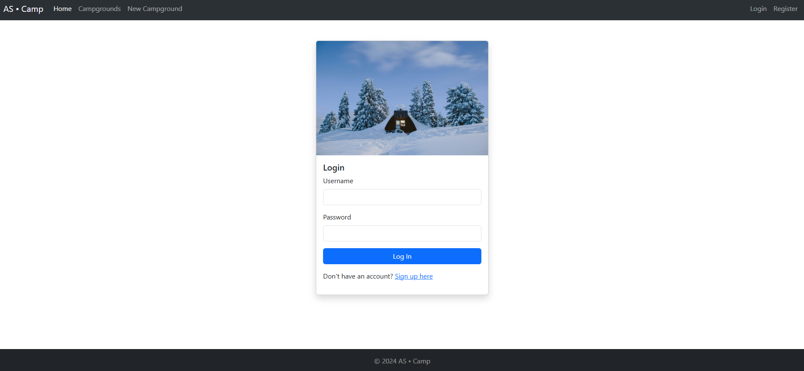

# **AS • Camp**

## **Introduction**
AS • Camp is a full-stack web application for discovering, sharing, and reviewing campgrounds. Users can post their own campsites, explore detailed locations, and leave comments. Built with Node.js, Express.js, MongoDB, and Map APIs, it features a responsive design and secure authentication.

<!-- Check out the live application here: [AS • Camp Demo](https://your-demo-link.com). -->

## **Features**
- 🌄 **Post and share campgrounds** with descriptions and images.
- 🗺️ **Explore campgrounds** using an interactive map.
- 💬 **Leave comments and reviews** on campsites.
- 📱 **Responsive design** for seamless usage across devices.
- 🔒 **Secure user authentication and authorization**.

## **Installation**

To install AS • Camp, follow these steps:

1. Clone the repository: **`git clone https://github.com/alsaim7/AS-Camp.git`**
2. Navigate to the project directory: **`cd AS-Camp`**
3. Install dependencies: **`npm install`**
4. Set up environment variables:
   - Create a `.env` file in the root directory.
   - Add the following:
     ```
     cloudinaryCloudName=   # Your Cloudinary account's cloud name
     cloudinaryKey=         # API key from Cloudinary
     cloudinarySecret=      # API secret from Cloudinary
     maptilerApiKey=        # API key from MapTiler
     mySecret=              # Secret key for session management
     dbUrl=                 # MongoDB connection string
     ```
5. Start the project: **`node app.js`**

## **Usage**

1. Open the project in your favorite code editor.
2. Modify the source code to fit your needs.
3. Start the project: **`node app.js`**
4. Access the application at `http://localhost:3000`.

**Troubleshooting**  
- Ensure MongoDB is running and the environment variables are correctly set.
- Check the console for error logs during runtime.

## **Screenshots**

### **Authentication**
- **Login**
    
- **Register**
    

### **Campground Browsing**
- **Homepage**
    
- **Campgrounds List**
    
- **Search Results**
    
- **Campground Details**
    

### **Campground Management**
- **Add New Campground**
    
- **Update Existing Campground**
    

## **Contributing**

If you'd like to contribute to AS • Camp, here are some guidelines:

1. Fork the repository.
2. Create a new branch for your changes.
3. Make your changes.
4. Write tests to cover your changes.
5. Run the tests to ensure they pass.
6. Commit your changes.
7. Push your changes to your forked repository.
8. Submit a pull request.

Please follow the coding style outlined in the [CONTRIBUTING.md](./CONTRIBUTING.md) file. For issues or suggestions, feel free to open an issue.

## **Authors and Acknowledgment**

AS • Camp was created by **[Er. Al Saim Shakeel](https://github.com/alsaim7)**. Special thanks to the developers of Node.js, Express.js, MongoDB, and Map APIs.

## **Contact**

- **Email**: [alsaimshakeel45@gmail.com](mailto:alsaimshakeel45@gmail.com)  
- **GitHub**: [alsaim7](https://github.com/alsaim7)